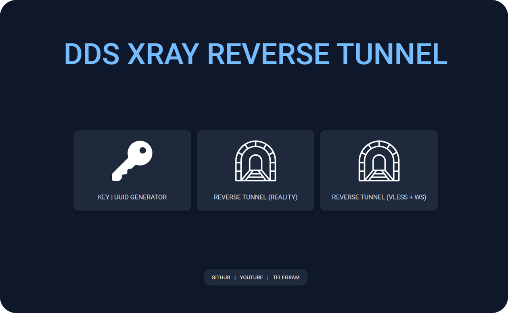

# Easy Reverse Tunnel with Xray Core
[Read this in Persian](./README.md)

 

This project includes tools for generating UUIDs and ready-made configurations for creating reverse tunnels using the Xray core in various panels, including Marzban.

## Contents

- [Introduction](#introduction)
- [Usage](#usage)
- [Video Tutorial](#video-tutorial)
- [Useful Links](#useful-links)
- [Support](#support)

## Introduction

This project includes tools for generating UUIDs and configurations for two reverse tunnels for Xray. These tools help you easily generate the necessary configurations.

## Usage

This project includes HTML, CSS, and JavaScript files that you can use offline. To use the tools available in this project, simply open the HTML files in your browser:

- [UUID Generator](./Key_Generator/index.html)
- [Reverse Tunnel Configurations (Reality)](./Reality/index.html)
- [Reverse Tunnel Configurations (VLESS-WS)](./VLESS-WS/index.html)

## Video Tutorial

To watch the video tutorial for this project, visit the following link:

[Video Tutorial on YouTube](https://www.youtube.com/yourvideo)

## Useful Links

- [GitHub Pages](https://azavaxhuman.github.io/Xray_ReverseTunnel/)
- [GitHub Repository](https://github.com/azavaxhuman/Xray_ReverseTunnel)

## Support

If you found this project useful, please give it a star.
